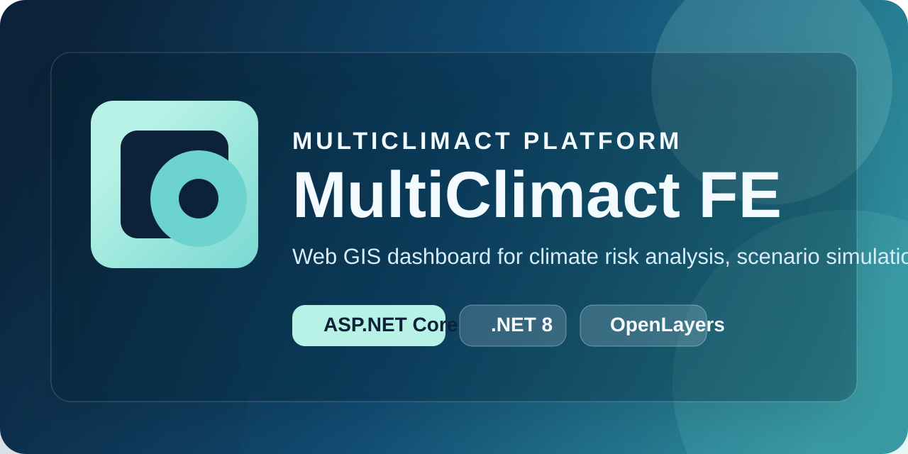

# MultiClimact FE

<p align="center">
  
</p>

<p align="center">
  Front-end ASP.NET Core per l'esplorazione geospaziale dei rischi climatici, la consultazione di layer WMS e l'avvio di simulazioni per scenari estremi.
</p>

<p align="center">
  <a href="#overview">Overview</a> •
  <a href="#stack">Stack</a> •
  <a href="#quick-start">Quick start</a> •
  <a href="#configuration">Configuration</a> •
  <a href="#docker">Docker</a> •
  <a href="#wms-notes">WMS notes</a>
</p>

<p align="center">
  
  
  
  
  
</p>

## Overview

MultiClimact FE e' l'interfaccia web del progetto MULTICLIMACT. L'applicazione combina Razor Pages, controller proxy e mappe OpenLayers per:

- visualizzare layer WMS e dati territoriali su piu' mappe tematiche;
- consultare run recenti per terremoti, ondate di calore e precipitazioni estreme;
- lanciare simulazioni e analizzare risultati lato UI;
- integrare servizi remoti tramite client HTTP tipizzati e proxy API.

## Stack

| Area | Dettagli |
| --- | --- |
| Backend web | ASP.NET Core 8, Razor Pages, MVC Controllers |
| Data access | EF Core 8, PostgreSQL in produzione, SQLite per sviluppo locale |
| Geospatial UI | OpenLayers, WMS proxy, layer toggling lato client |
| External services | Earthquake, Heatwave, Extreme Precipitation, Graph services |
| API docs | Swagger / OpenAPI |

## Project Layout

| Path | Scopo |
| --- | --- |
| `Pages/` | Razor Pages, partials e pannelli UI della dashboard |
| `Controllers/` | Proxy e API per WMS, terremoti, heatwave e servizi esterni |
| `Services/` | Typed `HttpClient` e helper applicativi |
| `Data/` | `ApplicationDbContext` e bootstrap database |
| `Models/` | View model e DTO |
| `Resources/` | Risorse per localizzazione |
| `wwwroot/` | Asset statici, JavaScript, CSS e immagini |
| `docs/assets/` | Asset locali usati nella documentazione |

## Quick Start

### Prerequisites

- `.NET SDK 8.0`
- un database PostgreSQL raggiungibile, oppure SQLite per sviluppo locale
- endpoint configurati per i servizi esterni usati dall'app

### Run locally

```bash
dotnet build
dotnet ef database update
dotnet watch run
```

Per sviluppo locale con SQLite, imposta `DatabaseProvider=Sqlite` e una `ConnectionStrings:SqliteConnection` valida. In questo scenario il progetto puo' creare automaticamente lo schema locale senza usare le migration PostgreSQL.

L'app parte tipicamente su `https://localhost:5001` o sulla porta assegnata da ASP.NET Core in ambiente locale.

## Configuration

Le impostazioni principali stanno in `appsettings.json`, con override in `appsettings.Development.json`, variabili d'ambiente o `dotnet user-secrets`.

| Key | Descrizione |
| --- | --- |
| `DatabaseProvider` | `Sqlite` per sviluppo locale oppure `PostgreSQL` |
| `ConnectionStrings:DefaultConnection` | connection string PostgreSQL |
| `ConnectionStrings:SqliteConnection` | connection string SQLite |
| `EarthquakeService:BaseUrl` | base URL del servizio terremoti |
| `HeatwaveService:BaseUrl` | base URL del servizio heatwave |
| `ExtremeprecipitationService:BaseUrl` | base URL del servizio precipitazioni estreme |
| `GraphService:BaseUrl` | base URL del servizio grafi |
| `wms:*` | URL e layer name per i servizi WMS |

Per evitare commit di segreti:

```bash
dotnet user-secrets set "ConnectionStrings:DefaultConnection" "Host=...;Database=...;Username=...;Password=..."
```

## Docker

### Build image

```bash
docker build -t multiclimact-fe .
```

### Run container

```bash
docker run --rm -it -p 8080:8080 --name multiclimact-fe \
  -e ASPNETCORE_ENVIRONMENT=Production \
  -e DatabaseProvider=PostgreSQL \
  -e ConnectionStrings__DefaultConnection="Host=<host>;Username=<user>;Password=<password>;Database=<db>" \
  multiclimact-fe
```

L'app ascolta su `http://localhost:8080`. Se preferisci SQLite persistente, monta un volume su `/app` o `/data` in base alla configurazione del container.

### Docker Compose

```bash
docker compose up --build
docker compose down
```

## WMS Notes

La homepage costruisce le configurazioni mappa leggendo il blocco `wms` da `appsettings.json`, esponendo poi URL e nomi layer alla UI tramite `ViewData`. I file chiave per questa parte sono:

- `Pages/Index.cshtml.cs` per il mapping configurazione -> view
- `wwwroot/js/maps-init.js` per l'inizializzazione delle mappe
- `wwwroot/js/openlayer-wms-helper.js` per gestione layer e matrice WMS
- `Controllers/WmsProxyController.cs` per il proxy `GetFeatureInfo` e le chiamate verso il server WMS

Nota pratica: usa URL WMS base senza query string gia' appendata. I parametri `service`, `request` e simili vengono composti dall'applicazione.

## Adding a New WMS Layer

1. Aggiungi in `appsettings.json` le nuove chiavi `wmsurl_<nome>` e `wmslayer_<nome>`.
2. Estendi il mapping in `Pages/Index.cshtml.cs`.
3. Aggiorna `wwwroot/js/maps-init.js` o la relativa `layerMatrix`.
4. Collega i controlli UI in `Pages/Shared/_TabPanels_C.cshtml` o nel pannello interessato.
5. Se il layer richiede un server diverso, aggiorna anche `Controllers/WmsProxyController.cs`.

## Connectivity Checklist

- `dotnet build` deve completarsi senza errori
- `dotnet ef database update` deve raggiungere il database corretto
- i servizi Earthquake / Heatwave / Extreme Precipitation devono rispondere sulla base URL configurata
- il WMS deve restituire correttamente `GetCapabilities`
- avviando `dotnet run` la homepage deve caricare mappa, layer toggle e richieste `GetFeatureInfo`

## Development Notes

- Mantieni la logica UI dentro `*.cshtml.cs` e i controller piu' sottili possibile.
- Tratta come obbligatorie le warning di nullability.
- Prima di pubblicare modifiche, esegui `dotnet format` quando possibile.
- Se aggiungi test, usa xUnit in `MultiClimact.Tests/`.
